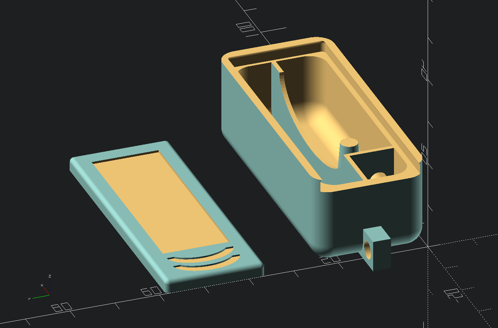

# Spangenzubehör

---

> https://forgejo.mueller.network/Zentonic/Spangenzubehoer.git 
> 
> Mirror: https://github.com/zentonic/mirror.Spangenzubehoer.git

---

> License: cc-by-sa-4.0 Author: holm / Christian Müller (https://mueller.network)

3D Druck Vorlage für ein Zubehördöschen mit Schiebedeckel.

Platz für
* Interdentalbürstchen
* frische Gummiringe
* Zahnspangenwachs
* Selbstklebende Spiegelfolie in einer Aussparung im Deckel

[STL-Download](STL/)

Die Döschen auf [Mastodon](https://social.saarland/@holm/112083961379337663)

